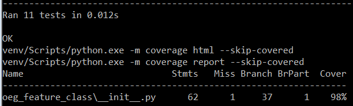

# oeg_feature_class

[](https://travis-ci.org/vb64/oeg.feature.class)
[](https://codeclimate.com/github/vb64/oeg.feature.class)
[](https://coveralls.io/github/vb64/oeg.feature.class?branch=master)

Этот модуль Python реализует определение "класса размера дефекта" трубопровода согласно [Specifications and requirements for intelligent pig inspection of pipelines](http://www.iliassociation.org/documents/industry/POF%20specs%20V3_2%20January%202005.pdf) 


А также проверку точности определения размеров дефектов и порога обнаружения при продольном и поперечном намагничивании согласно "Р Газпром2-2.3-919-2015 ОСНОВНОЕ И ВСПОМОГАТЕЛЬНОЕ ОБОРУДОВАНИЕ ДЛЯ ВНУТРИТРУБНОГО ДИАГНОСТИРОВАНИЯ Технические требования".


## Установка

```
$ pip install oeg_feature_class
```

## Использование

```python
# функция size_class определяет "класс размера" дефекта при заданных длине, ширине дефекта и толщине стенки трубы.
from oeg_feature_class import size_class, FeatureClass

# дефект размером 100x100 мм на стенке трубы толщиной 10 мм является дефектом класса "обширный"
size_class(100, 100, 10) == FeatureClass.GENE
True
# дефекты с нулевыми размерами не допускаются
size_class(0, 100, 10)
oeg_feature_class.Error: Wrong FeatureClass params. l=0 w=100 t=10

# функция is_detectable определяет, должен ли выявляться дефект заданных размеров на заданной толщине стенки трубы
# при указанном типе намагничивания
from oeg_feature_class import is_detectable, MagnetType

# дефект размером 10x10 мм глубиной 5 мм на стенке трубы толщиной 11 мм должен определяться снарядами с продольным намагничиванием
is_detectable((10, 10, 5), 11, magnet_type=MagnetType.MFL)
True

# функция is_in_limits проверяет, укладываются ли в допустимую погрешность вычисленные размеры дефекта по сравнению с его реальными размерами
# при заданных толщине стенки трубы и типе намагничивания
from oeg_feature_class import is_in_limits

# реальные размеры дефекта: длина 90 мм, ширина 12 мм, глубина 4 мм
real = (90, 12, 4)
# вычисленные размеры дефекта: длина 72 мм, ширина 11 мм, глубина 1 мм
calcked = (72, 11, 1)

# проверяем, соответствуют ли вычисленные размеры дефекта допускам, если толщина стенки трубы равна 16.6 мм и тип намагничивания поперечный
length_ok, width_ok, depth_ok = is_in_limits(calcked, real, 16.6, magnet_type=MagnetType.TFI)

# вычисленная длина укладывается в допустимую погрешность
length_ok
True
# вычисленная ширина укладывается в допустимую погрешность
width_ok
True
# вычисленная глубина НЕ укладывается в допустимую погрешность
depth_ok
False
```

## Разработка

```
$ git clone git@github.com:vb64/oeg.feature.class.git
$ cd oeg.feature.class
```
При использовании Python 3.7:
```
$ make setup PYTHON_BIN=/path/to/python37/executable
```
При использовании Python 2.7:
```
$ make setup2 PYTHON_BIN=/path/to/python27/executable
```
После запуска набора автотестов
```
$ make tests
```
в случае успеха вы должны увидеть что-то типа этого:


